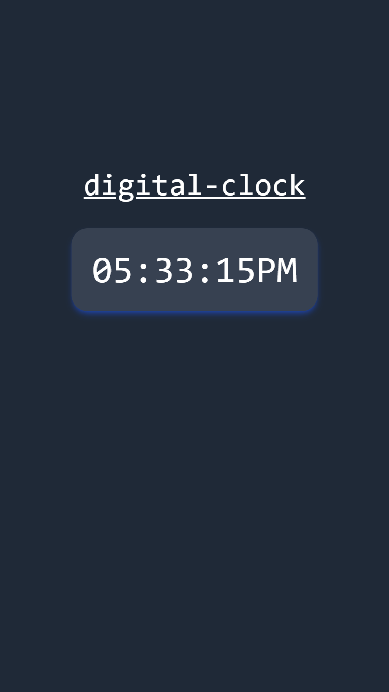

# JavaScript Dom

**Digital Clock using JavaScript DOM & Tailwind CSS**

- In this project, I created a **Digital Clock** using **JavaScript DOM manipulation** and styled it with **Tailwind CSS**. The current time is dynamically fetched using JavaScript's `Date` object, and updated every second using `setInterval()`. The time is displayed in **HH:MM:SS** format by accessing and updating the DOM element using `document.getElementById()`.

---

### live demo link

-

---

### Live Preview

- 
